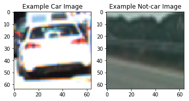
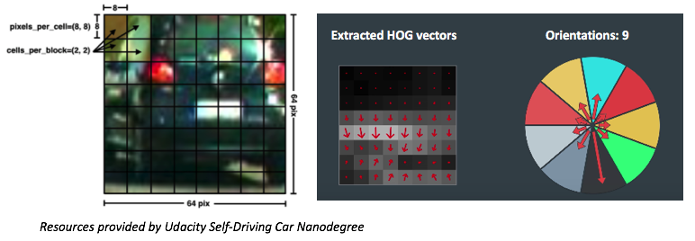
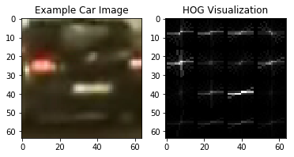
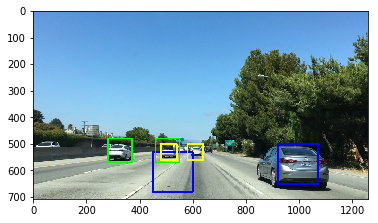
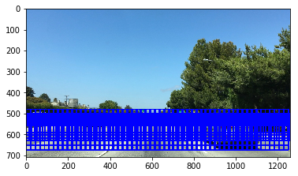
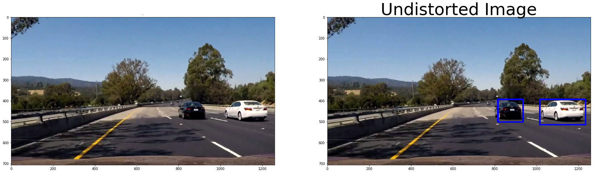
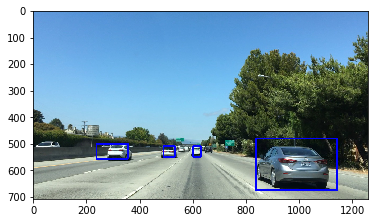

# Self Driving Car Nanodegree
### Project 5 - Vehicle Tracking Project
---

In this project, images taken from a front-facing camera mounted on a vehicle is analyzed to detect and track other vehicles. The process are conducted in the following orders:

**Phase 1 - Extracting Features and Training Linear SVM Classifier**
1. Load training images (of cars and "not-cars") and examine them.
2. Define functions to extract characteristic features from the training images:  
    2.1 HOG  
    2.2 Spatial Bin  
    2.3 Color Histogram  
    2.4 A pipeline function to flag/extract features from image/images.  

3. Prepare training and testing dataset:  
    3.1 Use feature extraction function to extract features from images.  
    3.2 Train Linear SVM Classifier.

**Phase 2 - Using Sliding Window to find cars**
1. Define a sliding-window function to search subset of an image.
2. Define Heatmap to remove false positives.
3. Apply classifier to the subset of image for classification.
4. Draw rectangles around vehicles.

Complete codes and results for this project can be found in the  [`vehicle_detection_project.ipynb`](https://github.com/kwonjh90/SDCND-AdvancedLaneFinding/blob/master/P3-shorter.ipynb)  

### 1. HOG Feature Extraction and Training.
I first started the project with loading images of vehicles and non-vehicles. These images were used to train a classifier that was later used to classify unseen images of vehicles/non-vehicles taken from a front-facing camera mounted on a vehicle. Code for this process can be found below the title *1. Load training images and examine them.*  

  

Different parameters were tested out to find the best performing HOG feature extraction. Following are the resulting parameters:
* color_space: RGB
* orientations: 11
* pixels_per_cell: 16
* cells_per_block: 2

How these parameters comes into play in the HOG feature extraction is visualized below.
  
Following are the resulting images after applying HOG feature extraction to random vehicle image. Codes for this section can be found below the title *2.1 HOG features*  
  

### 2. Training classifier using the selected HOG features.
Other than the HOG feature, color histogram and spatial features were also used to enhance the classifier's performance in vehicle detection.
* Spatial Bin: Pixel values of a shrinked image turned into a feature vector.
* Color Hist: Similar to HOG, but this time with a histogram of color values.
Feature vectors were scaled to zero mean and unit variance. This allowed feature of different scales to be counted equally.

SVM classifier was trained with the feature vectors of training data. Feature vectors of vehicles was assigned labels of one and that of non-vehicles zeros.  
Parameters for the SVM classifiers were determined using a `GridSearch()`. Resulting parameters were:
* C = 10
* kernel = 'rbf'
GridSearch is not included in the code cells because running it took a long time, and after acquiring the parameters, I used them for granted without running the GridSearch every time I ran the project.
Resulting classification accuracy was 99.59%.

### 3. Sliding Window Search
Three scales(sizes) of sliding windows were chosen: 50px, 90px, and 150px. The sizes were arbitrarily chosen based on fitting three squares that seemed to be a good fit for capturing a vehicle in different proximities. Testing squares drawn can be seen below:  
  
In addition to the three sizes, following parameters were implemented to optimize vehicle detection process:
* percentage overlap: 85% (0.85)
* ranges covered by each window size:
    * Large: 680 - 480 px
    * Medium: 630 - 500 px
    * Small: 560 - 500 px  

This resulted in the windows covering the the following areas of an image:   
  

### 4. Vehicle detection demonstration and optimization.
The above parameters performed very well in detecting vehicles both in test images provided by Udacity.

The resulting images are shown below:  
  
  

Another parameter that had to be tunes was the heatmap threshold number, which determined the minimal number of overlapping windows to be deemed as a positive detection of a vehicle. In the beginning, setting it to 2 frames caught to many false positives; it detected a grey fence with shadow as a vehicle. After adjusting it to a higher number, the detection pipeline successfully determined vehicles only.

### 5. More False Positive Filtration.
False positives were further filtered out by implementing a queue-like method. I added a cumulative heatmap that added heatmap of consecutive five frames of the video. Output after implementing this can be found from the link below:  

### 6. Problems/Issues
1. Parameters of sliding windows will have to be adjusted according to the characteristic of images/videos. For example, if area of an image where cars appear are larger, the section where sliding window searches will have to be adjusted.
2. Thresholds of heatmaps and other parameters are unique to the types of images. For example, images of different hues and brightness will have to be processed with different parameters.
